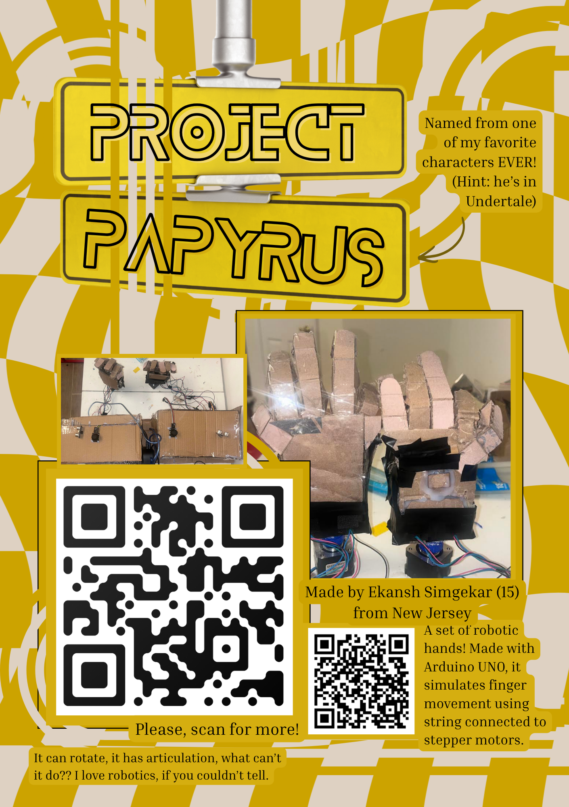
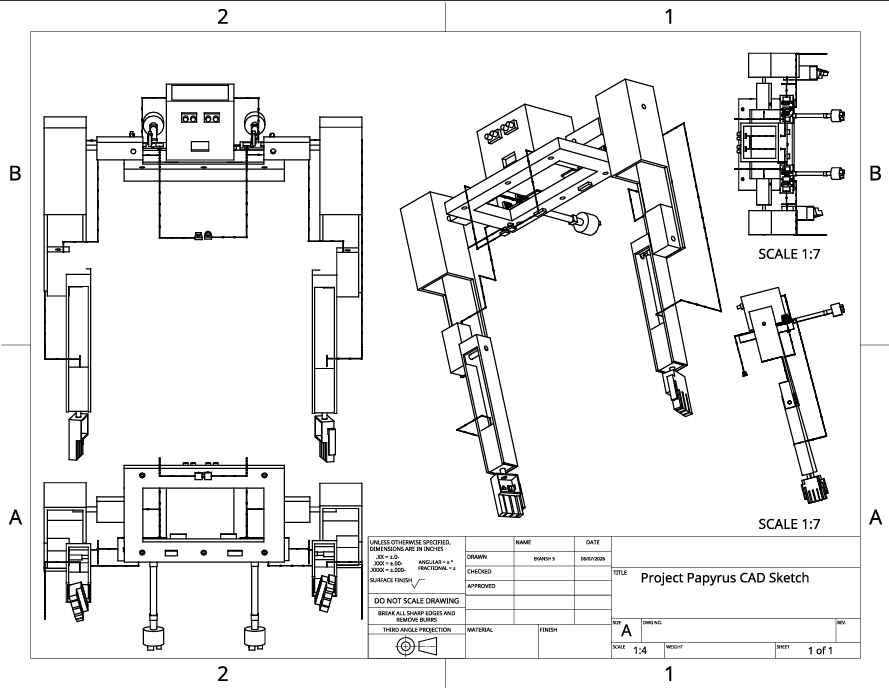

# Project Papyrus

*A public repo of my work for Hack Club: Fallout! Subject to various updates. This github is meant to be paired with the neccessary Arduino hardware that is the bulk of the project.*



## About It:

Hello! Welcome to my most ambitious project of my technological career yet! This project, named after a certain character from a video game, was at first meant to be a whole robot that I could control with a mask. However, due to time and money constraints (and for the sake of Fallout) I had to shorten it down to two wearable arms and a mask. Recently, I noticed a vital flaw in my design that caused me to scrap a good chunk of it. After many modifications, the project is done as two controllable hands with ultrasonic sensors and joysticks. The joystick controlls the fingers and the rotational movement, being able to fully form a fist or hand gestures with its controls. It utlizes strings to control the fingers, with a stepper motor moving the strings back and forth to simulate movement. I am quite proud of this unique way it simulates a real life human hand, as I haven't seen it done before. Holding the joystick down rotates the hand and moving the left/right (or up/down) moves it clockwise/counterclockwise. I decided to make this as a evolution of a previous Arduino experiment I made, using servos instead for a hand. However, that only had one hand that had little finger movement with no rotation. I plan to update this with a whole wearable arm like I tried previously, but for now please look more into my project below!

---

## Wiring:


Above is a wiring diagram that will help to understand the components used! The entire thing is centered around the arduino circutry, using breadboards, NEMA-17 stepper motors, and ultrasonic sensors. My computer science teacher suggested keeping all of the stepper motors centralized, to avoid excess power usage, coming at the cost of only being able to use one motor at a time (to avoid burnout). The stepper motors are regulated by the drivers and kept cool with the fans. Capacitors store power in the case of fluculation. Two stepper motors are used for the movement of fingers and one is used at the bottom for hand rotational movement. Go Johnny Go!

---

## CAD Design:



Feel free to download the individual pieces from this github repo, but this is a 3D model of my innovation! I still feel that I am a beginner in onshape, but this project helped further my skills in this area. It's so nice to see that time and effort that is put into a project can be rewarded. Components are attached by industrial grade glue, used in my own robotics team to attach circutry. The bill of materials can be found [here.](BOM.csv) A link to my onshape can be found here: https://cad.onshape.com/documents/a3976ec1db42c092d0e7bb52/w/d015cfe781e8d86ab63d2d9d/e/b42a30408853c60ea30fe035?renderMode=0&uiState=6a358437e9e5174e9fd6137b

---

## Build Guide:

This system utlizes two arduinos, Arduino A, for the ultrasonic and joystick, and Arduino B, for the stepper motors. Since putting all of the wiring onto one arduino wasn't possible, with voltage and wiring space, I utlized six signal wires to provide arduino B information from arduino A about distance and joystick behavior. Based on that info, Arduino B would drive three NEMA - 17 motors based on the signals. This structure allowed me to make the behavior of my innovation look like:
- Joystick goes UP, Motor A spins clockwise.
- Joystick goes DOWN, Motor A spins counterclockwise.
- Joystick goes LEFT, Motor B spins clockwise.
- Joystick goes RIGHT, Motor B spins counterclockwise.
- Joystick gets pressed, Motor C spins.

The code specifies that only one motor should move at a time, and the joystick input takes priority. When an object is detected 20 cm away, all three motors run a full forward then reverse sequence one after another (ABC order).

### 1. Parts List

| Part | Qty | Notes |
|---|---|---|
| Arduino Uno (or Uno-compatible board) | 2 | One labeled "A" (sensor board), one "B" (motor board). |
| NEMA 17 stepper motor | 3 | Standard 1.8°/step (200 steps/rev) bipolar motor |
| TMC2209 stepper driver module | 3 | One per motor. STEP/DIR/EN interface used here (no UART configuration) |
| HC-SR04 ultrasonic distance sensor | 1 | |
| Analog joystick module (2-axis + button) | 1 | VRX, VRY, SW, VCC, GND pinout |
| 12 V DC power supply | 1 | Powers motor coils (VMOT) only — sized for your motors' rated current x3 |
| 5–9 V regulated supply or battery pack for each Arduino | 2 | — a single small 9V alkaline battery is **not recommended** |
| Breadboard(s) and jumper wires | — | Solid-core wires or well-seated jumpers recommended for reliability |
| Common ground bus / rail | — | All grounds (both Arduinos, both power supplies, all drivers, sensor, joystick) must tie to one shared point |

---

### 2. Arduino A — Sensor and Joystick Wiring

**Ultrasonic Sensor (HC-SR04)**

| HC-SR04 Pin | Arduino A Pin |
|---|---|
| VCC | 5V |
| GND | GND |
| Trig | D10 |
| Echo | D5 |

**Joystick Module (powered at 3.3 V)**

| Joystick Pin | Arduino A Pin |
|---|---|
| VCC | 3.3V |
| GND | GND |
| VRX | A0 |
| VRY | A1 |
| SW | D8 |

**Outputs from Arduino A → Arduino B**

| Signal | Arduino A Pin | Purpose |
|---|---|---|
| sigA | D2 | Motor A move flag (HIGH = move) |
| sigA_dir | D6 | Motor A direction (HIGH = UP/CW, LOW = DOWN/CCW) |
| sigB | D3 | Motor B move flag (HIGH = move) |
| sigB_dir | D7 | Motor B direction (HIGH = LEFT/CW, LOW = RIGHT/CCW) |
| sigC | D4 | Motor C move flag (HIGH = button pressed) |
| sigU | D9 | Ultrasonic trigger pulse (HIGH = object detected) |
| GND | GND | Shared ground — **critical**, see Section 6 |

---

### 3. Arduino B — Motor Board Wiring

**Inputs from Arduino A**

| Signal | Arduino B Pin | From Arduino A Pin |
|---|---|---|
| sigA | A0 | D2 |
| sigA_dir | A1 | D6 |
| sigB | D10 | D3 |
| sigB_dir | A2 | D7 |
| sigC | D5 | D4 |
| sigU | D9 | D9 |
| GND | GND | GND |

> **Do not use Arduino B's pin 1 (TX) or pin 0 (RX) for any signal wire.**
> Those pins connect to the onboard USB-to-serial chip. A signal wire sharing
> that pin will corrupt Serial communication and can cause the board to behave
> as if it's resetting. This guide's pinout avoids them entirely.

**TMC2209 Driver → Motor Wiring**

| Motor | STEP | DIR | EN | Driver power |
|---|---|---|---|---|
| Motor A | D11 | D12 | D13 | VIO → 5V, VMOT → 12V supply, GND → common ground |
| Motor B | D6 | D7 | D8 | VIO → 5V, VMOT → 12V supply, GND → common ground |
| Motor C | D3 | D2 | D4 | VIO → 5V, VMOT → 12V supply, GND → common ground |

EN is active-LOW on the TMC2209 — the code holds all three EN pins LOW at startup to keep the drivers enabled.

---

### 4. Step-by-Step Assembly

1. **Build the ground network first.** Connect a ground rail/bus that ties together: Arduino A GND, Arduino B GND, the 12V supply's negative terminal, all three TMC2209 GND pins, the joystick GND, and the ultrasonic sensor GND. Use more than one wire between Arduino A and Arduino B's grounds if possible — this single network is the most common source of problems in this build (see Section 6).

2. **Wire the ultrasonic sensor and joystick to Arduino A** per the tables in Section 2.

3. **Wire the three TMC2209 drivers to Arduino B** per Section 3. Double check STEP/DIR/EN per motor — these are easy to cross between motors.

4. **Connect VMOT on all three TMC2209 boards to the 12V supply**, separate from the Arduinos' own power. Do not power the motors from the same small battery powering Arduino logic.

5. **Run the six signal wires + ground wire from Arduino A to Arduino B** exactly per the table in Section 3. Press connections in firmly; loose breadboard contacts are a common cause of intermittent motor behavior.

6. **Upload the code** (Section 5) — Arduino A's sketch to board A, Arduino B's sketch to board B. Leave both connected to USB for first testing.

7. **Test on USB power first.** Confirm joystick directions move the correct motor the correct way, the button moves Motor C, and waving a hand within 20 cm of the ultrasonic sensor triggers the full sequence. In my experience, it only worked on USB power, 9v batteries were NOT enough.

---

### 5. Code

**Arduino A — Sensor & Joystick Controller**

```cpp
// ============================================================
//  ARDUINO A — Sensor & Joystick Controller
// ============================================================
//
//  WIRING — Arduino A:
//    Ultrasonic HC-SR04:  Trig -> pin 10,  Echo -> pin 5
//                         VCC  -> 5V,      GND  -> GND
//    Joystick (3.3V):     VRX  -> A0,      VRY  -> A1
//                         SW   -> pin 8,   VCC  -> 3.3V
//                         GND  -> GND
//
//  WIRING — Arduino A -> Arduino B (6 signal wires + GND):
//    A pin 2  -> B pin A0   (Motor A move flag)
//    A pin 6  -> B pin A1   (Motor A direction)
//    A pin 3  -> B pin 10   (Motor B move flag)
//    A pin 7  -> B pin A2   (Motor B direction)
//    A pin 4  -> B pin 5    (Motor C / button)
//    A pin 9  -> B pin 9    (Ultrasonic trigger)
//    A GND    -> B GND
//
//  BEHAVIOUR:
//    Joystick UP    -> Motor A clockwise
//    Joystick DOWN  -> Motor A counterclockwise
//    Joystick LEFT  -> Motor B clockwise
//    Joystick RIGHT -> Motor B counterclockwise
//    Joystick button -> Motor C
//    Object < 20cm (no joystick input) -> ultrasonic sequence on B
// ============================================================

const int trigPin = 10;
const int echoPin = 5;

const int vrxPin = A0;
const int vryPin = A1;
const int swPin  = 8;

const int sigA     = 2;  // Motor A move flag
const int sigA_dir = 6;  // Motor A direction: HIGH = UP (CW), LOW = DOWN (CCW)
const int sigB     = 3;  // Motor B move flag
const int sigB_dir = 7;  // Motor B direction: HIGH = LEFT (CW), LOW = RIGHT (CCW)
const int sigC     = 4;  // Motor C (button)
const int sigU     = 9;  // Ultrasonic trigger

// Joystick dead-zone thresholds.
// Joystick is 3.3V powered -> analogRead range is roughly 0-675, center ~338.
// Run the calibration sketch in Section 8 if your readings differ.
const int JOY_LOW  = 250;
const int JOY_HIGH = 450;

long readUltrasonic() {
  digitalWrite(trigPin, LOW);
  delayMicroseconds(2);
  digitalWrite(trigPin, HIGH);
  delayMicroseconds(10);
  digitalWrite(trigPin, LOW);
  long duration = pulseIn(echoPin, HIGH, 30000); // 30ms timeout
  if (duration == 0) return 999;                  // nothing detected
  return duration * 0.034 / 2;                    // convert to cm
}

void setup() {
  pinMode(trigPin, OUTPUT);
  pinMode(echoPin, INPUT);
  pinMode(swPin, INPUT_PULLUP);

  pinMode(sigA, OUTPUT);
  pinMode(sigA_dir, OUTPUT);
  pinMode(sigB, OUTPUT);
  pinMode(sigB_dir, OUTPUT);
  pinMode(sigC, OUTPUT);
  pinMode(sigU, OUTPUT);

  digitalWrite(sigA, LOW);
  digitalWrite(sigA_dir, LOW);
  digitalWrite(sigB, LOW);
  digitalWrite(sigB_dir, LOW);
  digitalWrite(sigC, LOW);
  digitalWrite(sigU, LOW);
}

void loop() {
  // --- Ultrasonic trigger ---
  long dist = readUltrasonic();
  if (dist > 0 && dist < 20) {
    digitalWrite(sigU, HIGH);
    delay(100);
    digitalWrite(sigU, LOW);
  }

  // --- Joystick read ---
  int xVal  = analogRead(vrxPin);
  int yVal  = analogRead(vryPin);
  int swVal = digitalRead(swPin);

  bool up    = (yVal < JOY_LOW);
  bool down  = (yVal > JOY_HIGH);
  bool left  = (xVal < JOY_LOW);
  bool right = (xVal > JOY_HIGH);

  digitalWrite(sigA, (up || down) ? HIGH : LOW);
  digitalWrite(sigA_dir, up ? HIGH : LOW);

  digitalWrite(sigB, (left || right) ? HIGH : LOW);
  digitalWrite(sigB_dir, left ? HIGH : LOW);

  digitalWrite(sigC, (swVal == LOW) ? HIGH : LOW);

  delay(20); // ~50Hz polling rate
}
```

**Arduino B — Motor Controller**

```cpp
// ============================================================
//  ARDUINO B — Motor Controller (3x NEMA 17 via TMC2209)
// ============================================================
//
//  WIRING — Signals from Arduino A (6 signal wires + GND):
//    B pin A0  <- A pin 2   (Motor A move flag)
//    B pin A1  <- A pin 6   (Motor A direction)
//    B pin 10  <- A pin 3   (Motor B move flag)
//    B pin A2  <- A pin 7   (Motor B direction)
//    B pin 5   <- A pin 4   (Motor C / button)
//    B pin 9   <- A pin 9   (Ultrasonic trigger)
//    B GND     <- A GND
//
//  Motor A driver:  STEP -> 11, DIR -> 12, EN -> 13
//  Motor B driver:  STEP -> 6,  DIR -> 7,  EN -> 8
//  Motor C driver:  STEP -> 3,  DIR -> 2,  EN -> 4
//  All drivers: VIO -> 5V (logic), VMOT -> 12V external supply, GND -> common
// ============================================================

const int sigA     = A0;
const int sigA_dir = A1;
const int sigB     = 10;
const int sigB_dir = A2;
const int sigC     = 5;
const int sigU     = 9;

const int stepA = 11, dirA = 12, enA = 13;
const int stepB = 6,  dirB = 7,  enB = 8;
const int stepC = 3,  dirC = 2,  enC = 4;

// --- Joystick-tap speed per motor (microseconds per half-pulse, lower = faster) ---
const int STEP_DELAY_A   = 12000; // Motor A — slow
const int STEP_DELAY_B   = 1000;  // Motor B — fast
const int STEP_DELAY_C   = 1000;  // Motor C — fast
const int JOYSTICK_STEPS = 3;     // steps fired per joystick poll

// --- Acceleration ramp settings for the ultrasonic sequence ---
// Long moves ramp from START_DELAY (slow/high torque) down to each
// motor's cruise speed (MIN_DELAY_x) and back up before stopping —
// this prevents stalling against a stationary/weighted load.
const int START_DELAY = 3000;
const int MIN_DELAY_A = 500;
const int MIN_DELAY_B = 200;
const int MIN_DELAY_C = 200;
const int RAMP_STEPS  = 100;

void stepMotor(int stepPin, int steps, int delayMicros) {
  for (int i = 0; i < steps; i++) {
    digitalWrite(stepPin, HIGH);
    delayMicroseconds(delayMicros);
    digitalWrite(stepPin, LOW);
    delayMicroseconds(delayMicros);
  }
}

void stepMotorRamped(int stepPin, int totalSteps, int minDelay) {
  for (int i = 0; i < totalSteps; i++) {
    int delayMicros;
    if (i < RAMP_STEPS) {
      delayMicros = START_DELAY - ((START_DELAY - minDelay) * i / RAMP_STEPS);
    } else if (i >= totalSteps - RAMP_STEPS) {
      int stepsFromEnd = totalSteps - i;
      delayMicros = START_DELAY - ((START_DELAY - minDelay) * stepsFromEnd / RAMP_STEPS);
    } else {
      delayMicros = minDelay;
    }
    digitalWrite(stepPin, HIGH);
    delayMicroseconds(delayMicros);
    digitalWrite(stepPin, LOW);
    delayMicroseconds(delayMicros);
  }
}

// --- Debounce: majority-vote filter to reject brief noise spikes on
//     the signal lines (caused by motor switching noise on shared ground) ---
const int SAMPLES = 10;
const int SAMPLE_GAP_US = 50;
const int THRESHOLD = 7; // need at least 7 of 10 samples HIGH to count as active

bool readStable(int pin) {
  int count = 0;
  for (int i = 0; i < SAMPLES; i++) {
    if (digitalRead(pin) == HIGH) count++;
    delayMicroseconds(SAMPLE_GAP_US);
  }
  return count >= THRESHOLD;
}

void setup() {
  pinMode(sigA, INPUT);
  pinMode(sigA_dir, INPUT);
  pinMode(sigB, INPUT);
  pinMode(sigB_dir, INPUT);
  pinMode(sigC, INPUT);
  pinMode(sigU, INPUT);

  pinMode(stepA, OUTPUT); pinMode(dirA, OUTPUT); pinMode(enA, OUTPUT);
  pinMode(stepB, OUTPUT); pinMode(dirB, OUTPUT); pinMode(enB, OUTPUT);
  pinMode(stepC, OUTPUT); pinMode(dirC, OUTPUT); pinMode(enC, OUTPUT);

  // EN is active LOW on TMC2209 -- enable all drivers at startup
  digitalWrite(enA, LOW);
  digitalWrite(enB, LOW);
  digitalWrite(enC, LOW);
}

void loop() {
  bool A = readStable(sigA);
  bool B = readStable(sigB);
  bool C = readStable(sigC);
  bool U = readStable(sigU);

  // === JOYSTICK PRIORITY (one motor at a time) ===
  if (A) {
    bool dirHigh = readStable(sigA_dir);
    digitalWrite(dirA, dirHigh ? HIGH : LOW);
    stepMotor(stepA, JOYSTICK_STEPS, STEP_DELAY_A);
    return;
  }

  if (B) {
    bool dirHigh = readStable(sigB_dir);
    digitalWrite(dirB, dirHigh ? HIGH : LOW);
    stepMotor(stepB, JOYSTICK_STEPS, STEP_DELAY_B);
    return;
  }

  if (C) {
    digitalWrite(dirC, HIGH);
    stepMotor(stepC, JOYSTICK_STEPS, STEP_DELAY_C);
    return;
  }

  // === ULTRASONIC SEQUENCE (only runs if no joystick input active) ===
  if (U) {
    digitalWrite(dirA, HIGH);
    stepMotorRamped(stepA, 1000, MIN_DELAY_A);
    digitalWrite(dirA, LOW);
    stepMotorRamped(stepA, 1000, MIN_DELAY_A);

    digitalWrite(dirB, HIGH);
    stepMotorRamped(stepB, 1000, MIN_DELAY_B);
    digitalWrite(dirB, LOW);
    stepMotorRamped(stepB, 1000, MIN_DELAY_B);

    digitalWrite(dirC, HIGH);
    stepMotorRamped(stepC, 1000, MIN_DELAY_C);
    digitalWrite(dirC, LOW);
    stepMotorRamped(stepC, 1000, MIN_DELAY_C);
  }
}
```

---

### 6. Power Supply Notes

- **Motor power (VMOT) and Arduino logic power must be separate supplies**, joined only by a common ground. Do not power motors from the same battery/supply powering the Arduino's 5V logic.
- **A single small 9V alkaline battery is not a good choice** for Arduino logic power in this build. It has low capacity (~500 mAh) and its voltage sags under load — and switching noise from the TMC2209 drivers coupling back through the shared ground can be enough to brown out or glitch the microcontroller right as motors start moving. A AA battery pack (6-8 cells, regulated) or a small regulated 7-12V supply per Arduino is more reliable.
- **Pin 1 (TX) and pin 0 (RX) on Arduino B are reserved** for the onboard USB-to-serial chip. Avoid routing any project signal through them; this guide's pinout (Section 3) does not use them, freeing them up for `Serial.begin()` debugging whenever Arduino B is connected to USB.

---

### 7. Troubleshooting Quick Reference

| Symptom | Likely cause | Fix |
|---|---|---|
| Only one motor ever moves, even unprompted | A signal pin is floating or noisy | Confirm wiring matches Section 3 exactly; check ground network (Section 6) |
| Works on USB, fails on battery | Weak/sagging battery, or ground bounce with no USB ground backbone | Use a better-quality supply; add parallel ground wires (Section 6/7) |
| "USB device malfunctioned" on plug-in | Damaged USB chip/cable/port from an earlier fault, or driver issue | Try a different cable/port/computer to isolate; reinstall CH340 driver if applicable |
| Upload fails: "programmer is not responding" | Serial Monitor left open blocking the port, or wrong board/port selected | Close Serial Monitor, verify Tools > Board/Port, try a different USB cable |
| Direction (CW/CCW) inconsistent on one axis | Loose connection on that direction wire, or noise not fully filtered | Wiggle-test the wire at both ends while running; reseat or add a parallel wire |
| Motor stalls/buzzes under load instead of turning | Insufficient torque at the speed commanded, or TMC2209 current limit (Vref) too low | Use `stepMotorRamped()` for long moves; check/raise the driver's current limit via its Vref trimpot |
