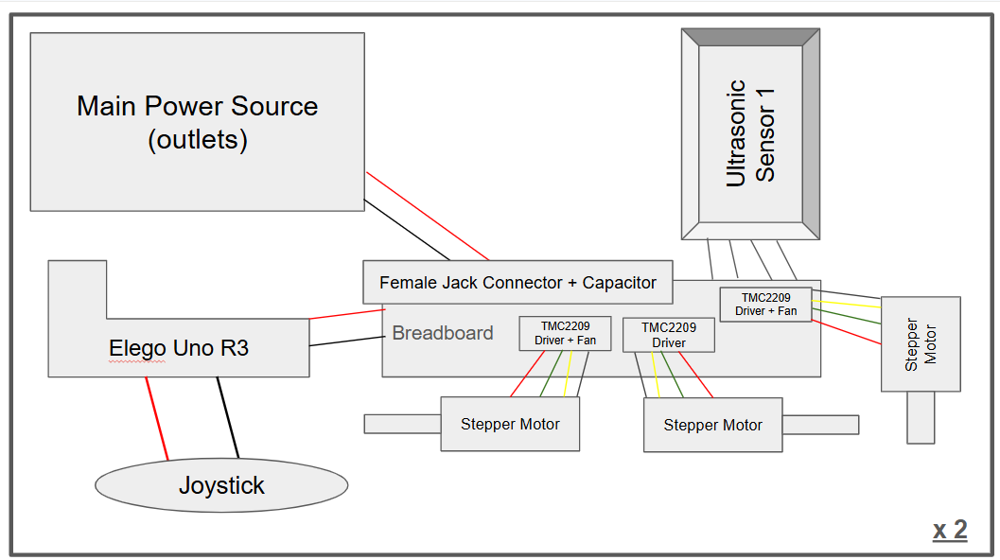
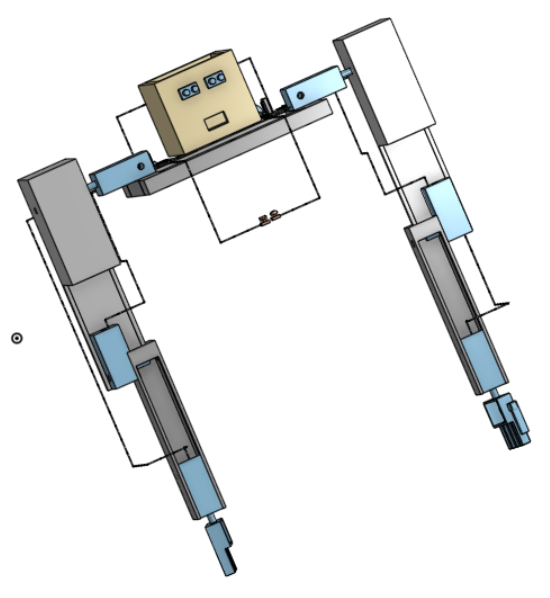

# ProjectPapyrus!
A public repo of my work for Hack Club: Fallout! Subject to various updates.
This github is meant to be paired with the neccessary Arduino hardware that is the bulk of the project. 

Hello! Welcome to my most ambitious project of my technological career yet! This project, named after a certain character from a video game, was at first meant to be a whole robot that I could control with a mask. However, due to time and money constraints (and for the sake of Fallout) I had to shorten it down to two wearable arms and a mask. If you've played Poppy Playtime, you might be able to picture what my innovation looks like, since my inspiration was the protagonist's controllable robotic hands. There are two ways to use it, the mask and the joysticks. The joysticks are more self-explanatory, controlling them controll the six total motors used for individual joints. The cooler option, the sensing mask, utlizes ultrasonic sensors to pinpoint the distance from a surface, and react based on that. I wish I had an interesting reason for making this, like to help those to suffer from a lack of hands or something important like that. But to be honest, I just wanted to test the limits of how far my desire to build can go. I've always wanted to be an engineer, and I feel like the skills learnt from taking on this project will come in handy in the future. I'm building off a previous project where I made a robotic hand (from the wrist up) out of the same Arduino components, so that is also part of my inspiration. Anyways, the arms are wearable and would go onto the users shoulders, allowing for a cool expeirience with controlling them. Please, look into the more detailed aspects of my project below! 

Above is a wiring diagram that will help to understand the components used! The entire thing is centered around the arduino circutry, using breadboards, servos, and ultrasonic sensors. My computer science teacher suggested keeping all of the stepper motors centralized, to avoid excess power usage, coming at the cost of only being able to use one motor at a time. The stepper motors are regulated by the drivers and kept cool with the fans. Capacitors regulate power and make sure nothing burns out. The circutry on the right is for the movement of fingers and on the left is for the shoulder, elbow, and hand rotational movement. Go Johnny Go!

Feel free to download the individual pieces from this github repo, but this is a 3D model of my innovation! I still feel that I am a beginner in onshape, but this project helped further my skills in this area. It's so nice to see that time and effort that is put into a project can be rewarded. Components are attached by Double‑Sided Foam Tape, a strong item that was used in my own robotics team to attach circutry.

Code to be added as I continue work on this!!!

