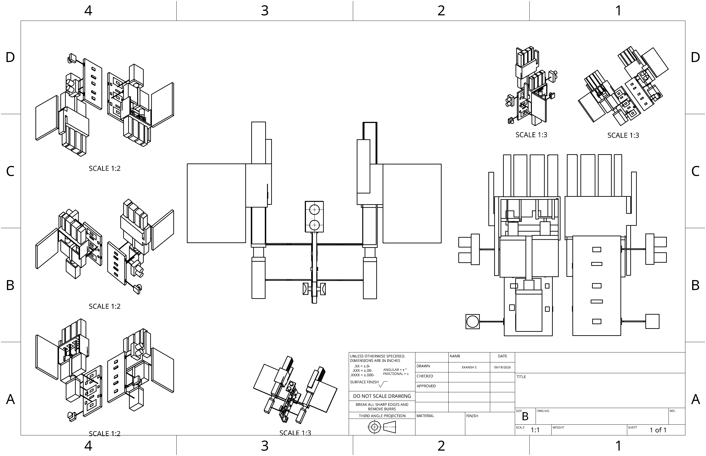

# Project Papyrus
### A public repo of my work for Hack Club: Fallout! Subject to various updates. This github is meant to be paired with the neccessary Arduino hardware that is the bulk of the project.

 
## About It: 
Hello! Welcome to my most ambitious project of my technological career yet! This project, named after a certain character from a video game, was at first meant to be a whole robot that I could control with a mask. However, due to time and money constraints (and for the sake of Fallout) I had to shorten it down to two wearable arms and a mask. Recently, I noticed a vital flaw in my design that caused me to scrap a good chunk of it. After many modifications, the project is done as two controllable hands with ultrasonic sensors and joysticks. The joystick controlls the fingers and the rotational movement, being able to fully form a fist or hand gestures with its controls. It utlizes strings to control the fingers, with a stepper motor moving the strings back and forth to simulate movement. I am quite proud of this unique way it simulates a real life human hand, as I haven't seen it done before. Holding the joystick down rotates the hand and moving the left/right (or up/down) moves it clockwise/counterclockwise. I decided to make this as a evolution of a previous Arduino experiment I made, using servos instead for a hand. However, that only had one hand that had little finger movement with no rotation. I plan to update this with a whole wearable arm like I tried previously, but for now please look more into my project below!

---------------------------------------------------------------------------------------------------------------------------

## Wiring: 

Above is a wiring diagram that will help to understand the components used! The entire thing is centered around the arduino circutry, using breadboards, NEMA-17 stepper motors, and ultrasonic sensors. My computer science teacher suggested keeping all of the stepper motors centralized, to avoid excess power usage, coming at the cost of only being able to use one motor at a time (to avoid burnout). The stepper motors are regulated by the drivers and kept cool with the fans. Capacitors store power in the case of fluculation. Two stepper motors are used for the movement of fingers and one is used at the bottom for hand rotational movement. Go Johnny Go!

---------------------------------------------------------------------------------------------------------------------------
## CAD Design: 

Feel free to download the individual pieces from this github repo, but this is a 3D model of my innovation! I still feel that I am a beginner in onshape, but this project helped further my skills in this area. It's so nice to see that time and effort that is put into a project can be rewarded. Components are attached by industrial grade glue, used in my own robotics team to attach circutry. The bill of materials can be found [here.](materials.csv)

---------------------------------------------------------------------------------------------------------------------------
This system utlizes two arduinos, Arduino A, for the ultrasonic and joystick, and Arduino B, for the stepper motors. Since putting all of the wiring onto one arduino wasn't possible, with voltage and wiring space, I utlized six signal wires to provide arduino B information from arduino A about distance and joystick behavior. 

